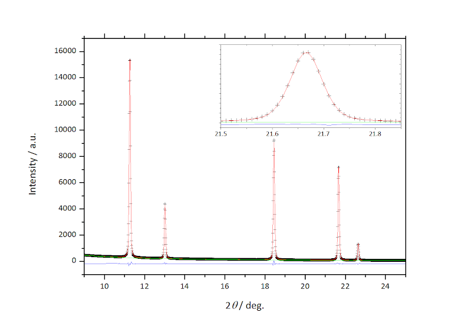

profile function
角度分散型プロファイル関数については、このページ↓からダウンロードできる
[GSASで用いられている角度分散型.pdf](./GSASで用いられている角度分散型.pdf)
を参照のこと。

・Lab x-ray (micro7)の場合、CW (continuous wavelength) 3で

GU  0.407213E+02
GV  -0.959465E+02
GW  0.550758E+02
GP  0
LX  0.398317E+01
LY  0.524333E+01
S/L  0.500000E-03
H/L  0.500000E-03
          
程度になる。（NIST Cr2O3でfitting)

・PF-18Cの場合、CW 3で以下のとおり。
測定条件
測定日:  2014/02/03
Sample  CeO2, (厚さ　0.05 mm程度）
コリメーター　0.1 mm
カメラ長　204 mm程度
プロファイルパラメータ
GU 0  
GV  -0.67091E+01
GW  0.734618E+01
GP 0
LX  0.262783E+01
LY 0
S/L  0.5 E-03 （０に近い値であればよい）
H/L  0.5 E-03 （０に近い値であればよい）

PF-18CでCL＝２００mm程度だと使える2θ範囲が3-25deg.程度と狭いので、ガウシアンのFWHMの角度依存は線形でもよい近似となる。（GU=0）

このときのフィッティングの結果↓
(最強線のカウントが15000、Rp = 00175, wRp = 0.0278)

[micro7.zip](./micro7.zip)